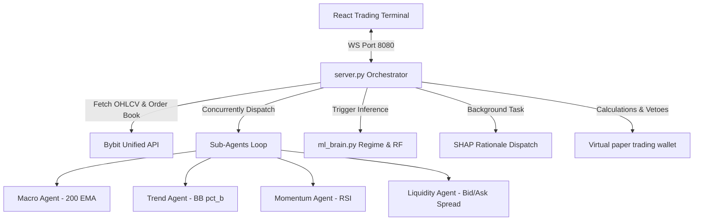

# OceanHub Algorithmic Trading Bot — Technical System Manual

This document serves as the absolute source of truth for the OceanHub multi-asset algorithmic trading bot architecture, config limits, survival constraints, and ML methodologies.

---

## 1. System & Process Architecture

The system consists of a Python 3.12 slim backend orchestrator running a WebSocket server on port `8080` and a React + Electron trading dashboard client.



### Process Orchestration:
- **`server.py`**: Manages WebSocket connections, streams live ticks, updates the virtual wallet state, processes closing signals on a 1m loop, and runs a 60s analysis cycle for active assets (`ADA/USDT`, `XRP/USDT`) and macro-indicator assets (`BTC/USDT`).
- **`ml_brain.py`**: Handles feature engineering, walk-forward validation (WFV) with Platt probability calibration, unsupervised and rule-based market regime detection, SHAP calculations, and path-dependent Triple Barrier labeling.
- **`agents.py`**: Code for the 4 deterministic sub-agents: Macro, Trend, Momentum, and Liquidity.
- **`master_agent.py`**: Interprets the matrix of sub-agent and ML brain votes, handles risk control, stops, target allocations, and writes performance/reasoning logs.
- **`config.py`**: Houses all hardcoded execution thresholds, survival caps, and logic parameters.

---

## 2. Hardcoded Phase 0 Dry Run Parameters

### Phase 0 Dry Run Mode (`main.py` & `config.py`)
- `DRY_RUN_MODE = True`
- When active:
  - Bot runs all indicators, analyses, logging, and rationales.
  - Toggling "LIVE" mode from the UI is blocked (defaults back to simulation/virtual paper trading).
  - Strictly forbids any order submission API calls to exchange mainnet/testnet endpoints.

### K-Means & Regime Definition (`ml_brain.py`)
- **Choppy Regime**: Classified if `ADX < 20` and `Rolling_Vol < 0.5%` (calculated over a rolling 20-bar window on close prices).
- If the regime is classified as Choppy, Random Forest predictions are bypassed, and a **HOLD** signal is forced to preserve capital.
- **Trending Regime**: If choppy bounds are not met, falls back to standard unsupervised K-Means clustering (volatility vs. returns).

### Triple Barrier Logic & Labeling (`ml_brain.py`)
- **Time Barrier**: 15 bars (evaluated on 3m timeframe).
- **ATR Stop Loss**: `1.5 * ATR`.
- **Dynamic Take Profit**: `3.0 * ATR` (yielding a 2:1 Reward-to-Risk ratio).
- **Tie-breaker**: If both TP and SL barriers are hit in the same bar:
  - LONG signals: Prioritize the Upper (TP) barrier (label as UPTREND / `2`).
  - SHORT signals: Prioritize the Upper (SL) barrier (yielding a loss / label as DOWNTREND-invalid / `0`) to enforce conservative labeling.

### Transaction Cost Veto (`server.py`)
- Before executing any LONG/SHORT, checks bid-ask spread and funding rate.
- **Smart Funding Check**: The Bybit funding rate is **only added** to the friction threshold if the current system UTC time is within **60 minutes** of a Bybit funding settlement (00:00, 08:00, 16:00 UTC).
- **Veto Trigger**: If total friction (`Spread_Percentage + Taker_Fee (0.055%) + Funding_Rate`) exceeds **0.15%**, a **HOLD** is forced.

### Kelly Survival Caps (`server.py`)
- **Max Position Size Cap**: Cap fractional Kelly bet at `0.25` (max 25% of the virtual wallet balance per position).
- **Max Leverage Cap**: Capped at `5x` cross-margin.

### Feature Schema Enforcer (`ml_brain.py`)
- Following Walk-Forward Validation and VIF pruning during training, selected feature column names are exported to `feature_schema.json`.
- Live inference loads `feature_schema.json`, drops any extra live features, and re-orders columns to perfectly match the training set to prevent train-serve skew.

### SHAP Task Timeout (`server.py`)
- Background SHAP tasks are dispatched asynchronously as a non-blocking `create_task` wrapped in `asyncio.wait_for(..., timeout=5.0)` to guarantee they never hang the main server loop.

---

## 3. UI Overrides & watermarks

### Watermark (`App.jsx`)
- Header displays a blinking amber watermark badge when `DRY RUN ACTIVE` is enabled to prevent confusion during development.

### Chop regime UI Override (`MasterAICore.jsx` & `HomeDashboard.jsx`)
- When the market regime is determined to be 'Choppy':
  - **Live Signal Matrix** overrides standard signal display boxes with a prominent amber alert box: **CHOP REGIME DETECTED — NO SIGNALS EXPECTED. CAPITAL PRESERVATION ACTIVE**.
  - **Home Dashboard grid cards** hide normal indicators and show a simplified **CHOP REGIME ACTIVE - CAPITAL PRESERVATION** block.

---

## 4. Operational Commands & Maintenance

### Compilation & Syntax Check
```powershell
# Compile check Python modules
python -c "import py_compile; py_compile.compile('backend/ml_brain.py', doraise=True); print('ml_brain: OK')"
python -c "import py_compile; py_compile.compile('backend/server.py', doraise=True); print('server: OK')"
```

### Launch Server
```powershell
cd backend
python main.py
```

### Launch Frontend Dev
```powershell
npm run dev
```
